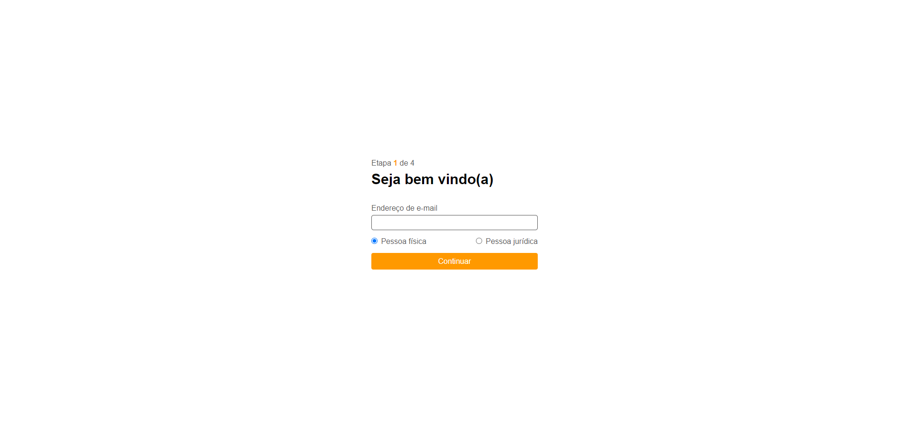

# Form app

## Para executar a aplicação, rodar os seguintes comandos:

`npm install`

`node app.js`

## Para visualizar, acessar localhost:3000/registration

### Arquivos do desenvolvimento front-end disponíveis na pasta web-form
